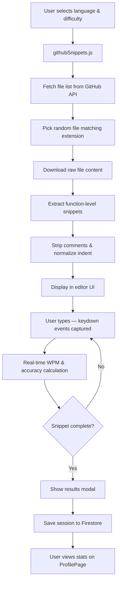

<p align="center">
  
</p>

<h1 align="center">Codistic</h1>

<p align="center">
  <strong>The Code Typing Engine — Practice typing real code, not prose.</strong>
</p>

<p align="center">
  <a href="#features">Features</a> •
  <a href="#demo">Demo</a> •
  <a href="#tech-stack">Tech Stack</a> •
  <a href="#getting-started">Getting Started</a> •
  <a href="#project-structure">Project Structure</a> •
  <a href="#configuration">Configuration</a> •
  <a href="#deployment">Deployment</a> •
  <a href="#contributing">Contributing</a> •
  <a href="#license">License</a>
</p>

---

## The Problem

Traditional typing trainers measure how fast you can type English. But when you sit down to actually code, you're battling an entirely different set of keystrokes: `{ } ( ) => [] === && || ;` — the symbols, indentation patterns, and nested syntax that no prose-based trainer ever practices. Codistic was built to fix that.

> *"When the keyboard becomes invisible, the code becomes effortless."*

---

## Features

### ⌨️ Real Code Snippets from GitHub
Snippets are pulled **live from top-tier open-source repositories** via the GitHub API. Every session uses actual production code — no contrived exercises or random character strings.

**Supported languages:**

| Language | Source Repos |
|----------|-------------|
| Python | `TheAlgorithms/Python` |
| JavaScript | `TheAlgorithms/JavaScript`, `trekhleb/javascript-algorithms` |
| Java | `TheAlgorithms/Java` |
| C++ | `TheAlgorithms/C-Plus-Plus` |
| Go | `TheAlgorithms/Go` |
| Rust | `TheAlgorithms/Rust` |

### 📏 Three Difficulty Tiers
- **Short** — Quick warm-ups (5–15 lines). Perfect for daily practice.
- **Warmup (Medium)** — Focused sessions (15–35 lines). Build consistency.
- **Full (Long)** — Deep sessions (up to 150 lines). Test your endurance.

### 🔗 Custom URL Loader
Paste any public code URL and type it instantly. GitHub blob URLs are **auto-converted to raw URLs**. Practice your own codebase, your team's style guide, or an open-source library you're studying.

### 🎨 11 Hand-Tuned Themes
Every theme is carefully adapted for readability and visual comfort during extended sessions.

| Theme | Accent | Style |
|-------|--------|-------|
| Dark | `#3B82F6` | Default dark mode |
| Light | `#2563eb` | Clean light mode |
| Retro | `#00ff41` | Green-on-black terminal |
| Solarized | `#268bd2` | Ethan Schoonover's classic |
| Nord | `#88c0d0` | Arctic, north-bluish palette |
| Catppuccin | `#cba6f7` | Soothing pastel aesthetic |
| Dracula | `#ff79c6` | Dark with vibrant accents |
| Gruvbox | `#fe8019` | Retro groove color scheme |
| Tokyo Night | `#7aa2f7` | Midnight in Tokyo |
| Monochrome | `#ffffff` | Pure black & white |
| Paper | `#000000` | Light monochrome — ink on paper |

### 🔤 6 Monospace Editor Fonts
Choose from **JetBrains Mono**, **Fira Code**, **Source Code Pro**, **Inconsolata**, **Space Mono**, and **Ubuntu Mono** — with adjustable font size (12–24px).

### 📊 Real-Time Performance Dashboard
- **Live stats** — WPM, accuracy, elapsed time, and progress tracked in real time as you type.
- **Performance Matrix** — Area chart of WPM trends across your last 30 sessions (powered by Recharts).
- **Activity Heatmap** — GitHub-style heatmap showing your practice consistency over the last 12 weeks.
- **Daily Streak** — Consecutive days practiced.
- **Proficiency Zenith** — Your top language with mastery progress, lines codified, and average accuracy.
- **Level System** — Progress through ranks: Novice I → Adept II → Pro III → Elite IV → Apex V.

### 🌊 Dynamic Background Engine
A canvas-based particle system renders falling code glyphs (`{ } => </> || && == [] ;`, `function`, `const`, `return`, etc.) that **accelerate with your WPM**. The faster you type, the more alive the background becomes.

### ☁️ Cloud-Synced Progress
Sign in with **Google** or **email/password** (Firebase Auth). All session data, preferences, and stats are persisted to **Firestore** and follow you across devices.

### ⏸️ Pause & Resume
Mid-session pause support — freeze the timer and resume without losing progress.

### 🛠️ Comprehensive Settings Dashboard
A tab-based settings page with:
- **Account** — Display name, profile picture (uploaded to Firebase Storage), email display.
- **Appearance** — Theme, font, and font size selection with a **live code preview** panel.
- **Shortcuts** — Reference for all keyboard controls.
- **About** — Origin story, philosophy, feature breakdown, and technology credits.
- **Contact** — Email and GitHub links with inline feedback form.

---

## Demo

> **Live:** Deployed on Vercel (check the repo for the latest URL).

### Core Typing Interface

```
┌──────────────────────────────────────────────────┐
│  🟢 codistic          WPM  ACC  TIME     Theme  │
├──────────────────────────────────────────────────┤
│  [python] [js] [java] [cpp] [go] [rust] │ ↺ new │
│  ━━━━━━━━━━━━━━━━━━━ 42% ━━━━━━━━━━━━━━━━━━━━  │
│  ┌────────────────────────────────────────────┐  │
│  │ ● ● ●    bubble_sort.py    TheAlgorithms  │  │
│  │  1 │ def bubble_sort(arr):                │  │
│  │  2 │     n = len(arr)                     │  │
│  │  3 │     for i in range(n - 1):           │  │
│  │  4 │         for j in range(n - i - 1):   │  │
│  │  5 │             if arr[j] > arr[j + 1]:  │  │
│  │  6 │                 arr[j], arr[j + 1]   │  │
│  │  7 │                 = arr[j + 1], arr[j] │  │
│  │  8 │     return arr                       │  │
│  └────────────────────────────────────────────┘  │
│  ┌─WPM──┐ ┌─ACC──┐ ┌─TIME─┐ ┌─PROG─┐           │
│  │  47  │ │ 96%  │ │ 23.4 │ │  42  │           │
│  └──────┘ └──────┘ └──────┘ └──────┘           │
└──────────────────────────────────────────────────┘
```

---

## Tech Stack

| Layer | Technology |
|-------|-----------|
| **Framework** | [React 19](https://react.dev) |
| **Build Tool** | [Vite 8](https://vitejs.dev) |
| **Authentication** | [Firebase Auth](https://firebase.google.com/docs/auth) (Google & Email/Password) |
| **Database** | [Cloud Firestore](https://firebase.google.com/docs/firestore) |
| **File Storage** | [Firebase Storage](https://firebase.google.com/docs/storage) (avatar uploads) |
| **Charts** | [Recharts](https://recharts.org) |
| **Routing** | [React Router v7](https://reactrouter.com) (with `pushState` URL management) |
| **Snippet Source** | [GitHub REST API](https://docs.github.com/en/rest) |
| **Fonts** | [Google Fonts](https://fonts.google.com) (DM Sans, Syne, JetBrains Mono, Fira Code, etc.) |
| **Hosting** | [Vercel](https://vercel.com) |

---

## Getting Started

### Prerequisites

- **Node.js** ≥ 18
- **npm** ≥ 9
- A **Firebase** project with Auth, Firestore, and Storage enabled
- A **GitHub Personal Access Token** (for the snippet API — avoids rate limits)

### 1. Clone the Repository

```bash
git clone https://github.com/saini07ayush/Codistic.git
cd Codistic
```

### 2. Install Dependencies

```bash
npm install
```

### 3. Configure Environment Variables

Create a `.env` file in the project root:

```env
VITE_FIREBASE_API_KEY=your_firebase_api_key
VITE_FIREBASE_AUTH_DOMAIN=your_project.firebaseapp.com
VITE_FIREBASE_PROJECT_ID=your_project_id
VITE_FIREBASE_STORAGE_BUCKET=your_project.appspot.com
VITE_FIREBASE_MESSAGING_SENDER_ID=your_sender_id
VITE_FIREBASE_APP_ID=your_app_id
VITE_GITHUB_TOKEN=ghp_your_github_personal_access_token
```

> **Note:** The GitHub token needs only **public repo read access**. It is used to avoid the 60 requests/hour unauthenticated rate limit.

### 4. Run the Dev Server

```bash
npm run dev
```

The app will be available at `http://localhost:5173`.

### 5. Build for Production

```bash
npm run build
npm run preview   # preview the production build locally
```

---

## Project Structure

```
codistic-app/
├── public/
│   ├── logo.jpeg              # App logo (favicon & branding)
│   ├── favicon.svg
│   └── icons.svg
├── src/
│   ├── main.jsx               # React DOM entry point
│   ├── App.jsx                # Root component (renders CodeTyper)
│   ├── codetyper.jsx          # 🔑 Core typing engine & main UI
│   ├── AuthPage.jsx           # Sign-in / sign-up page
│   ├── ProfilePage.jsx        # Statistics dashboard (charts, heatmap, streak)
│   ├── SettingsPage.jsx       # Settings dashboard (account, appearance, about, etc.)
│   ├── DynamicBackground.jsx  # Canvas particle system (falling code glyphs)
│   ├── themes.js              # Theme & accent color definitions (11 themes)
│   ├── firebase.js            # Firebase init (Auth, Firestore, Storage)
│   ├── index.css              # Global base styles
│   ├── App.css                # App-level styles
│   └── services/
│       └── githubSnippets.js  # GitHub API integration for fetching code snippets
├── index.html                 # HTML entry point (font preloading)
├── vite.config.js             # Vite configuration
├── vercel.json                # Vercel rewrites & CORS headers
├── package.json
├── .env                       # Environment variables (not committed)
└── .gitignore
```

### Key Files Explained

| File | Purpose |
|------|---------|
| `codetyper.jsx` | The heart of the app. Manages typing state, keypress handling, WPM/accuracy calculation, snippet loading, navigation routing, and renders the complete typing interface with inline CSS-in-JS. |
| `githubSnippets.js` | Fetches file lists from curated GitHub repos, extracts clean function-level snippets, strips comments/docstrings, normalizes indentation, and handles fallbacks. Supports short/medium/long difficulty tiers. |
| `ProfilePage.jsx` | Full statistics dashboard with Recharts area chart, activity heatmap, daily streak tracker, proficiency metrics, level system, and recent session log. |
| `SettingsPage.jsx` | Multi-tab settings with account management, appearance controls (with live preview), keyboard shortcut reference, detailed about page with origin story, and contact section. |
| `DynamicBackground.jsx` | Canvas-based animation rendering 80 particles of code symbols that fall at speeds proportional to the user's current WPM. Uses smooth interpolation to avoid jarring speed changes. |
| `themes.js` | Exports `THEMES` (11 full theme objects with 13+ color tokens each) and `THEME_ACCENTS` for per-theme accent colors. |

---

## Configuration

### Firebase Setup

1. Create a new project at [Firebase Console](https://console.firebase.google.com/).
2. Enable **Authentication** with Google and Email/Password providers.
3. Create a **Cloud Firestore** database.
4. Enable **Firebase Storage** (for avatar uploads).
5. Copy your web app config values into `.env`.

#### Firestore Data Model

```
users/
  └── {uid}/
      └── sessions/
          └── {sessionId}/
              ├── wpm: number
              ├── accuracy: number
              ├── elapsed: number
              ├── language: string
              ├── length: string ("short" | "medium" | "long" | "custom")
              ├── file: string
              ├── source: string
              └── timestamp: Timestamp
```

### GitHub Token

1. Go to [GitHub Settings → Developer Settings → Personal Access Tokens](https://github.com/settings/tokens).
2. Generate a **Fine-grained** or **Classic** token with `public_repo` read access.
3. Add it as `VITE_GITHUB_TOKEN` in your `.env`.

> Without a token, the GitHub API limits you to 60 requests/hour. With a token, the limit increases to 5,000/hour.

### Vercel Deployment

The included `vercel.json` configures:
- **SPA Rewrites** — All routes rewrite to `/index.html` for client-side routing.
- **CORS Headers** — `Cross-Origin-Opener-Policy: same-origin-allow-popups` is set to support Firebase Google Auth popups.

---

## How It Works



---

## Keyboard Controls

| Key | Action |
|-----|--------|
| Any character key | Start typing / insert character |
| `Tab` | Insert 4-space indentation |
| `Enter` | Insert newline |
| `Backspace` | Delete last character |

---

## Contributing

Contributions are welcome! Here's how to get started:

1. **Fork** the repository.
2. **Create a branch** for your feature: `git checkout -b feat/your-feature`.
3. **Commit** your changes: `git commit -m "feat: add your feature"`.
4. **Push** to your fork: `git push origin feat/your-feature`.
5. Open a **Pull Request** against `main`.

### Ideas for Contributions
- Additional language support (TypeScript, Ruby, PHP, etc.)
- Multiplayer / race mode
- More detailed per-character accuracy analysis
- Mobile-responsive layout improvements
- Syntax highlighting in the editor
- Offline mode with cached snippets

---

## License

This project is open source. See the repository for license details.

---

<p align="center">
  <strong>Crafted with obsession by a developer who just wanted to type code faster.</strong><br/>
  <sub>Made in India 🇮🇳</sub>
</p>
