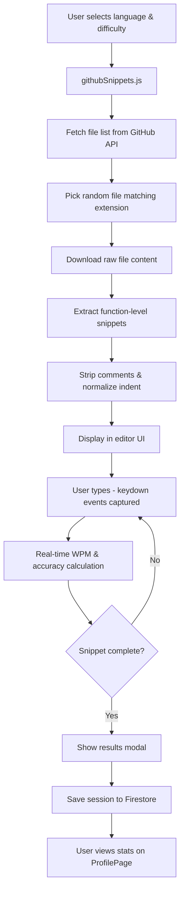

<p align="center">
  
</p>

<h1 align="center">Codistic</h1>

<p align="center">
  <strong>Protect your flow state. Practice typing real code, not prose.</strong>
</p>

<p align="center">
  <a href="https://codistic.xyz">Live App</a> •
  <a href="#the-problem">Why?</a> •
  <a href="#features">Features</a> •
  <a href="#tech-stack">Tech Stack</a> •
  <a href="#getting-started">Setup</a> •
  <a href="#project-structure">Structure</a> •
  <a href="#how-it-works">How It Works</a> •
  <a href="#contributing">Contributing</a>
</p>

<p align="center">
  
  
  
  
</p>

---

## The Problem

Traditional typing trainers measure how fast you type English prose. But when you sit down to code, you face a completely different set of keystrokes - `{ } ( ) => [] === && || ;` - the symbols, indentation patterns, and nested syntax that no prose trainer ever practices.

**Codistic** fixes that by pulling **real code from top-tier open-source repositories** and letting you type it keystroke-for-keystroke, with live performance tracking, a dynamic visual engine, and cloud-synced progress.

> *"When the keyboard becomes invisible, the code becomes effortless."*

---

## Features

### Real Code Snippets from GitHub

Every snippet is fetched **live from production-quality open-source repositories** via the GitHub API - never contrived exercises or random character strings.

| Language | Source Repos |
|----------|-------------|
| Python | `TheAlgorithms/Python` |
| JavaScript | `TheAlgorithms/JavaScript`, `trekhleb/javascript-algorithms` |
| Java | `TheAlgorithms/Java` |
| C++ | `TheAlgorithms/C-Plus-Plus` |
| Go | `TheAlgorithms/Go` |
| Rust | `TheAlgorithms/Rust` |

Snippets are intelligently extracted at the **function level**: docstrings are stripped, comments removed, and indentation normalized for a clean typing experience.

---

### Three Difficulty Tiers

| Tier | Lines | Best For |
|------|-------|----------|
| **Short** | 5 – 15 | Quick warm-ups & daily practice |
| **Medium** | 15 – 35 | Building consistency |
| **Long** | up to 150 | Deep-focus endurance sessions |

---

### Custom URL Loader

Paste **any public code URL** and type it instantly. GitHub blob URLs are **auto-converted to raw URLs** - practice your own codebase, your team's style guide, or any open-source library you're studying.

---

### Interactive Virtual Keyboard

A full **on-screen QWERTY keyboard** that mirrors your physical typing in real time:

- **Next-key highlighting** - the key you need to press next glows with a pulsing accent border, including Shift indicators for uppercase and symbols
- **Correct / Wrong flash** - keys flash green on correct presses and red on mistakes
- **Draggable** - grab the drag handle and reposition it anywhere on screen
- **Resizable** - drag the corner handle to scale between 50% - 150%, persisted to `localStorage`
- **Three size modes** - compact (floating overlay), small, and full-width
- **Toggle with `Ctrl + K`** - show or hide instantly without losing position

---

### Focus Mode & Fullscreen

Press `Ctrl + F` or start typing to enter **Focus Mode** - the navbar, footer, controls bar, and stats cards all collapse, leaving only the editor and the virtual keyboard visible. When fullscreen is enabled (configurable in Settings), Focus Mode automatically requests the browser Fullscreen API for a truly distraction-free experience.

- **Escape** exits focus mode
- **Fullscreen toggle** is independently configurable - you can use Focus Mode with or without actual fullscreen

---

### 11 Hand-Tuned Themes + Custom Theme Maker

Every built-in theme is carefully adapted for readability during extended sessions:

| Theme | Accent | Style |
|-------|--------|-------|
| Dark | `#3B82F6` | Default dark mode |
| Light | `#2563eb` | Clean light mode |
| Retro | `#00ff41` | Green-on-black terminal |
| Solarized | `#268bd2` | Ethan Schoonover's classic |
| Nord | `#88c0d0` | Arctic, north-bluish palette |
| Catppuccin | `#cba6f7` | Soothing pastel aesthetic |
| Dracula | `#ff79c6` | Dark with vibrant accents |
| Gruvbox | `#fe8019` | Retro groove color scheme |
| Tokyo Night | `#7aa2f7` | Midnight in Tokyo |
| Monochrome | `#ffffff` | Pure black & white |
| Paper | `#000000` | Light monochrome, ink on paper |

#### Custom Theme Maker

Build your **own theme** from scratch by picking 6 essential colors:

| Token | Controls |
|-------|----------|
| **Background** | Main page background |
| **Surface** | Cards & panels |
| **Text** | Primary text color |
| **Accent** | Highlights & buttons |
| **Correct** | Correctly typed characters |
| **Error** | Mistakes & wrong characters |

All remaining tokens (borders, muted text, overlays, etc.) are **auto-derived** using luminance detection and color blending - your 6 picks produce a complete, coherent 14-token theme.

#### Monkeytype Theme Import

Already have a theme you love on Monkeytype? Paste the Monkeytype share URL (containing `?customTheme=...`) and Codistic will **decode and apply it instantly**.

---

### 6 Built-in Fonts + Custom Font Manager

Choose from **JetBrains Mono**, **Fira Code**, **Source Code Pro**, **Inconsolata**, **Space Mono**, and **Ubuntu Mono**, with adjustable font size from 12 - 24px.

#### Custom Font Manager

Go beyond the defaults:

- **Google Fonts** - type any Google Font name and Codistic validates it in real time using the Font Loading API, then injects it via stylesheet
- **Upload your own** - drag-and-drop or browse for `.ttf`, `.woff`, `.woff2`, or `.otf` files (up to 2 MB each, max 10 uploaded fonts)
- Uploaded fonts are stored in **IndexedDB** as base64 data URLs and injected via `@font-face` - they persist across sessions with zero network requests
- Remove any custom font with one click; if the removed font was active, Codistic falls back to JetBrains Mono

---

### Real-Time Performance Dashboard

#### Live Stats
WPM, accuracy, elapsed time, and progress are tracked **in real time** as you type. The navbar dynamically switches between showing your **lifetime averages** (when idle) and **current session stats** (when typing).

#### Performance Matrix
An area chart of WPM trends across your **last 30 sessions**, powered by Recharts with a glowing gradient fill and custom tooltips.

#### Activity Heatmap
A GitHub-style contribution heatmap showing your practice consistency over the **last 12 weeks** (84 days), with intensity levels based on daily session count.

#### Daily Streak
Consecutive days practiced, calculated from Firestore timestamps with local timezone handling.

#### Proficiency Zenith
Your **top language** with:
- Peak WPM
- Average accuracy
- Lines codified (estimated from session difficulty)
- Mastery progress bar (WPM / 150 target)

#### Level System
Progress through ranks based on total session count:

| Sessions | Rank |
|----------|------|
| 0 – 9 | Novice I |
| 10 – 24 | Adept II |
| 25 – 49 | Pro III |
| 50 – 99 | Elite IV |
| 100+ | Apex V |

---

### Dynamic Background Engine

A canvas-based particle system renders **80 falling code glyphs** (`{ } => </> || && == [] ;`, `function`, `const`, `return`, etc.) that **accelerate with your WPM**. Speed changes use smooth interpolation to avoid jarring transitions. The faster you type, the more alive the background becomes.

---

### Cloud-Synced Progress

Sign in with **Google** or **email/password** (Firebase Auth). All session data, preferences, and stats are persisted to **Cloud Firestore** and follow you across devices.

- **Profile picture uploads** via Firebase Storage
- **Display name editing** with real-time profile updates

---

### Pause & Resume

Press `Ctrl + P` mid-session to freeze the timer. Resume without losing any progress - your elapsed time stays accurate.

---

### Comprehensive Settings Dashboard

A sidebar-tabbed settings page with five sections:

| Tab | Contents |
|-----|----------|
| **Account** | Display name, profile picture upload (Firebase Storage), email display |
| **Appearance** | Theme picker (built-in + custom), font picker (built-in + custom), font size slider, virtual keyboard toggle, tab size selector (2/4/8 spaces), focus fullscreen toggle, live code preview panel |
| **Shortcuts** | Complete keyboard shortcut reference |
| **About** | Origin story, philosophy, feature breakdown, and technology credits |
| **Contact** | Email and GitHub links with inline feedback form |

---

### Performance Optimizations

- **Lazy-loaded pages** - `AuthPage`, `ProfilePage`, and `SettingsPage` are loaded via `React.lazy()` + `Suspense` to keep the initial bundle lean
- **Async font loading** - optional editor fonts load with `media="print"` and swap on load
- **Font preconnects** - Google Fonts connections are prewarmed at HTML level
- **Snippet retry logic** - failed GitHub API calls are retried up to 5 times with 600ms delays
- **LocalStorage persistence** - theme, font, font size, tab size, keyboard visibility, keyboard scale, and fullscreen preference are all persisted client-side

---

## Demo

> **Live at [codistic.xyz](https://codistic.xyz)** — deployed on Vercel.

### Core Typing Interface

```
┌──────────────────────────────────────────────────┐
│  codistic             WPM  ACC  TIME     Theme  │
├──────────────────────────────────────────────────┤
│  [python] [js] [java] [cpp] [go] [rust] │ ↺ new │
│  ━━━━━━━━━━━━━━━━━━━ 42% ━━━━━━━━━━━━━━━━━━━━  │
│  ┌────────────────────────────────────────────┐  │
│  │ ● ● ●    bubble_sort.py    TheAlgorithms  │  │
│  │  1 │ def bubble_sort(arr):                │  │
│  │  2 │     n = len(arr)                     │  │
│  │  3 │     for i in range(n - 1):           │  │
│  │  4 │         for j in range(n - i - 1):   │  │
│  │  5 │             if arr[j] > arr[j + 1]:  │  │
│  │  6 │                 arr[j], arr[j + 1]   │  │
│  │  7 │                 = arr[j + 1], arr[j] │  │
│  │  8 │     return arr                       │  │
│  └────────────────────────────────────────────┘  │
│  ┌─WPM──┐ ┌─ACC──┐ ┌─TIME─┐ ┌─PROG─┐           │
│  │  47  │ │ 96%  │ │ 23.4 │ │  42  │           │
│  └──────┘ └──────┘ └──────┘ └──────┘           │
│  ┌────────────────────────────────────────────┐  │
│  │ `~ 1! 2@ 3# 4$ 5% 6^ 7& 8* 9( 0) -_ =+ ⌫│  │
│  │ Tab  Q  W  E  R  T  Y  U  I  O  P  [  ]  \│  │
│  │ Caps  A  S  D  F  G  H  J  K  L  ;  '  Ent│  │
│  │ Shift  Z  X  C  V  B  N  M  ,  .  /  Shift │  │
│  │              codistic.xyz                   │  │
│  └────────────────────────────────────────────┘  │
└──────────────────────────────────────────────────┘
```

---

## Tech Stack

| Layer | Technology |
|-------|-----------|
| **Framework** | [React 19](https://react.dev) |
| **Build Tool** | [Vite 8](https://vitejs.dev) |
| **Authentication** | [Firebase Auth](https://firebase.google.com/docs/auth) (Google & Email/Password) |
| **Database** | [Cloud Firestore](https://firebase.google.com/docs/firestore) |
| **File Storage** | [Firebase Storage](https://firebase.google.com/docs/storage) (avatar uploads) |
| **Font Storage** | [IndexedDB](https://developer.mozilla.org/en-US/docs/Web/API/IndexedDB_API) (uploaded custom fonts) |
| **Charts** | [Recharts](https://recharts.org) |
| **Routing** | [React Router v7](https://reactrouter.com) + `pushState` URL management |
| **Snippet Source** | [GitHub REST API](https://docs.github.com/en/rest) |
| **Fonts** | [Google Fonts](https://fonts.google.com) (DM Sans, Syne, JetBrains Mono, Fira Code, etc.) |
| **Hosting** | [Vercel](https://vercel.com) |

---

## Getting Started

### Prerequisites

- **Node.js** ≥ 18
- **npm** ≥ 9
- A **Firebase** project with Auth, Firestore, and Storage enabled
- A **GitHub Personal Access Token** (for the snippet API - avoids rate limits)

### 1. Clone the Repository

```bash
git clone https://github.com/saini07ayush/Codistic.git
cd Codistic
```

### 2. Install Dependencies

```bash
npm install
```

### 3. Configure Environment Variables

Create a `.env` file in the project root:

```env
VITE_FIREBASE_API_KEY=your_firebase_api_key
VITE_FIREBASE_AUTH_DOMAIN=your_project.firebaseapp.com
VITE_FIREBASE_PROJECT_ID=your_project_id
VITE_FIREBASE_STORAGE_BUCKET=your_project.appspot.com
VITE_FIREBASE_MESSAGING_SENDER_ID=your_sender_id
VITE_FIREBASE_APP_ID=your_app_id
VITE_GITHUB_TOKEN=ghp_your_github_personal_access_token
```

> **Note:** The GitHub token needs only **public repo read access**. It is used to avoid the 60 requests/hour unauthenticated rate limit. With a token, the limit increases to **5,000/hour**.

### 4. Run the Dev Server

```bash
npm run dev
```

The app will be available at `http://localhost:5173`.

### 5. Build for Production

```bash
npm run build
npm run preview   # preview the production build locally
```

---

## Project Structure

```
Codistic/
├── public/
│   ├── logo.jpeg                # App logo (favicon & branding)
│   └── icons.svg                # SVG icon sprite
├── src/
│   ├── main.jsx                 # React DOM entry point
│   ├── App.jsx                  # Root component
│   ├── codetyper.jsx            # Core typing engine & main UI
│   ├── AuthPage.jsx             # Sign-in / sign-up page
│   ├── ProfilePage.jsx          # Statistics dashboard (charts, heatmap, streak)
│   ├── SettingsPage.jsx         # Settings dashboard (5 tabs)
│   ├── VirtualKeyboard.jsx      # Interactive on-screen keyboard
│   ├── DynamicBackground.jsx    # Canvas particle system (falling code glyphs)
│   ├── themes.js                # 11 themes + custom theme builder
│   ├── fontManager.js           # Google Fonts + uploaded font management
│   ├── firebase.js              # Firebase init (Auth, Firestore, Storage)
│   ├── index.css                # Global base styles
│   ├── App.css                  # App-level styles
│   └── services/
│       └── githubSnippets.js    # GitHub API integration for fetching snippets
├── index.html                   # HTML entry point (font preloading)
├── vite.config.js               # Vite configuration
├── vercel.json                  # Vercel rewrites & CORS headers
├── package.json
├── .env                         # Environment variables (not committed)
└── .gitignore
```

### Key Files Explained

| File | Purpose |
|------|---------|
| `codetyper.jsx` | The heart of the app. Manages typing state, keypress handling, WPM/accuracy calculation, snippet loading, focus mode, pause/resume, fullscreen, URL routing, and renders the complete typing interface with CSS-in-JS. |
| `githubSnippets.js` | Fetches file lists from curated GitHub repos, extracts clean function-level snippets, strips comments/docstrings, normalizes indentation, and handles fallbacks. Supports short/medium/long difficulty tiers with retry logic. |
| `VirtualKeyboard.jsx` | Full QWERTY keyboard with next-key highlighting, correct/wrong keystroke flash, drag-to-reposition, corner-handle resize (0.5× – 1.5×), compact/small/full modes, and `Ctrl+K` toggle. |
| `ProfilePage.jsx` | Statistics dashboard with Recharts area chart, 12-week activity heatmap, daily streak tracker, proficiency zenith metrics, level system, and scrollable session log. |
| `SettingsPage.jsx` | 5-tab settings: account management, appearance controls (theme + custom theme maker + font + custom font manager + keyboard + tab size + fullscreen toggle with live preview), keyboard shortcut reference, about page, and contact section. |
| `fontManager.js` | Manages two font sources: Google Fonts (validated via Font Loading API, stored in localStorage) and uploaded font files (stored as base64 in IndexedDB with `@font-face` injection). Supports `.ttf`, `.woff`, `.woff2`, `.otf`. |
| `DynamicBackground.jsx` | Canvas animation rendering 80 particles of code symbols that fall at speeds proportional to the user's current WPM, with smooth interpolation to avoid jarring speed changes. |
| `themes.js` | Exports 11 built-in themes (14 color tokens each), accent colors, and the custom theme system (`buildThemeFromColors` derives 14 tokens from 6 user-picked colors using luminance detection and color blending). |

---

## Configuration

### Firebase Setup

1. Create a new project at [Firebase Console](https://console.firebase.google.com/).
2. Enable **Authentication** with Google and Email/Password providers.
3. Create a **Cloud Firestore** database.
4. Enable **Firebase Storage** (for avatar uploads).
5. Copy your web app config values into `.env`.

#### Firestore Data Model

```
users/
  └── {uid}/
      └── sessions/
          └── {sessionId}/
              ├── wpm: number
              ├── accuracy: number
              ├── elapsed: number
              ├── language: string
              ├── length: string ("short" | "medium" | "long" | "custom")
              ├── file: string
              ├── source: string
              └── timestamp: Timestamp
```

### GitHub Token

1. Go to [GitHub Settings → Developer Settings → Personal Access Tokens](https://github.com/settings/tokens).
2. Generate a **Fine-grained** or **Classic** token with `public_repo` read access.
3. Add it as `VITE_GITHUB_TOKEN` in your `.env`.

> Without a token, the GitHub API limits you to **60 requests/hour**. With a token, the limit increases to **5,000/hour**.

### Vercel Deployment

The included `vercel.json` configures:
- **SPA Rewrites**: All routes rewrite to `/index.html` for client-side routing.
- **CORS Headers**: `Cross-Origin-Opener-Policy: same-origin-allow-popups` is set to support Firebase Google Auth popups.

---

## How It Works


```mermaid
flowchart TD
    A[User selects language & difficulty] --> B[githubSnippets.js]
    B --> C[Fetch file list from GitHub API]
    C --> D[Pick random file matching extension]
    D --> E[Download raw file content]
    E --> F[Extract function-level snippets]
    F --> G[Strip comments & normalize indent]
    G --> H[Display in editor UI]
    H --> I[User types - keydown events captured]
    I --> J[Real-time WPM & accuracy calculation]
    J --> K{Snippet complete?}
    K -->|No| I
    K -->|Yes| L[Show results modal]
    L --> M[Save session to Firestore]
    M --> N[User views stats on ProfilePage]
```

---

## Keyboard Shortcuts

| Shortcut | Action |
|----------|--------|
| Any character key | Start typing / insert character |
| `Tab` | Insert indentation (configurable: 2, 4, or 8 spaces) |
| `Enter` | Insert newline |
| `Backspace` | Delete last character |
| `Ctrl + F` | Toggle focus mode |
| `Ctrl + K` | Show / hide virtual keyboard |
| `Ctrl + R` | Load a new snippet |
| `Ctrl + P` | Pause / resume current session |
| `Escape` | Exit focus mode |

---

## Client-Side Storage Map

Codistic persists user preferences locally for instant load times:

| Key | Storage | Purpose |
|-----|---------|---------|
| `codistic-theme` | localStorage | Selected theme name |
| `codistic-font` | localStorage | Selected font-family value |
| `codistic-fontsize` | localStorage | Editor font size (px) |
| `codistic-tabsize` | localStorage | Tab indentation width |
| `codistic-show-keyboard` | localStorage | Virtual keyboard visibility |
| `codistic-kb-scale` | localStorage | Virtual keyboard zoom level |
| `codistic-focus-fullscreen` | localStorage | Fullscreen on focus mode |
| `codistic-custom-theme` | localStorage | Custom theme color definitions |
| `codistic-custom-google-fonts` | localStorage | Saved Google Font names |
| `codistic-fonts` | IndexedDB | Uploaded font files (base64) |

---

## Contributing

Contributions are welcome! Here's how to get started:

1. **Fork** the repository.
2. **Create a branch** for your feature: `git checkout -b feat/your-feature`.
3. **Commit** your changes: `git commit -m "feat: add your feature"`.
4. **Push** to your fork: `git push origin feat/your-feature`.
5. Open a **Pull Request** against `main`.

### Ideas for Contributions

- Additional language support (TypeScript, Ruby, PHP, Swift, Kotlin)
- Multiplayer / race mode
- Per-character accuracy heatmap analysis
- Mobile-responsive layout improvements
- Syntax highlighting in the editor
- Offline mode with cached snippets
- Sound effects / haptic feedback for keystrokes
- Leaderboards & global rankings

---

## License

This project is open source. See the repository for license details.

---

<p align="center">
  <strong>Crafted with obsession by a developer who just wanted to type code faster.</strong><br/>
  <sub>Made in India 🇮🇳</sub>
</p>
